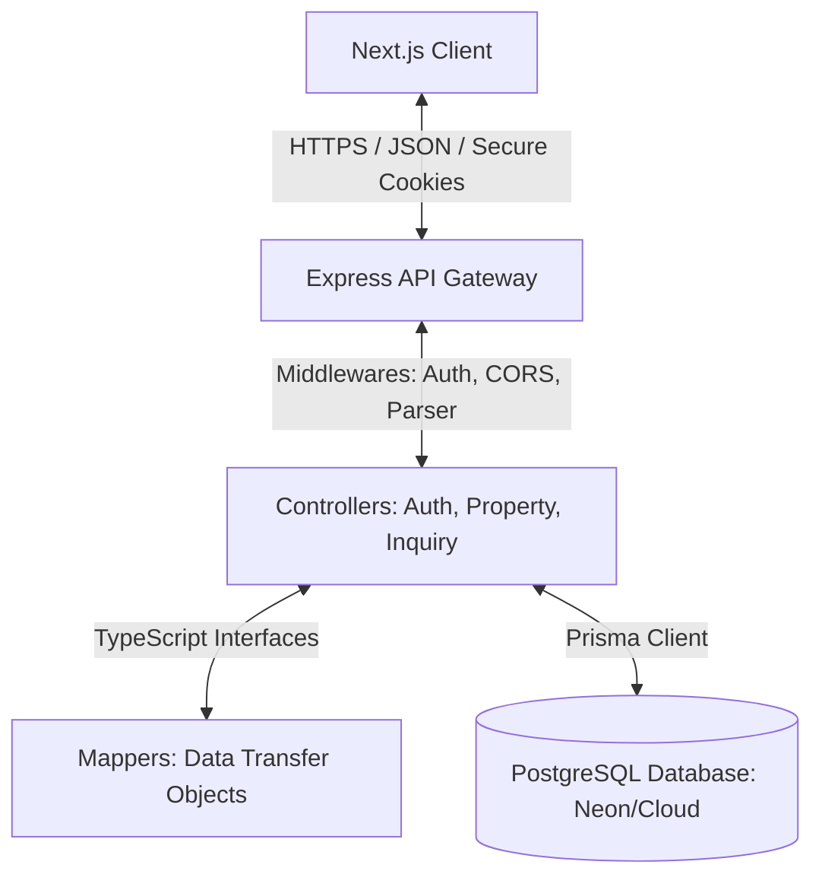

# Silicon Real Estate Backend: Engineering Blueprint & Architecture

This document outlines the production-ready backend engineering blueprint, directory structure, and database communication design for the **Silicon Real Estate (Pvt.) Ltd.** application. It is built using the **PERN stack** (PostgreSQL, Express, React/Next.js, Node.js) with **Prisma ORM** and **TypeScript** for enterprise-grade type safety and performance.

---

## 1. Architectural Overview

The backend is designed around a **layered architecture** (Three-Tier Pattern) to ensure separation of concerns, testability, and clean scalability.



### Key Architectural Pillars:
*   **Type Safety**: End-to-end type safety from the Prisma-generated client types to custom Express Request extensions and API response mappers.
*   **Secure Authentication**: Stateless, secure authentication using JSON Web Tokens (JWT) transmitted via **HTTP-only, Secure, SameSite=Strict cookies** to mitigate XSS and CSRF risks.
*   **Performance & Reliability**: Database connection pooling, automated query logging in development, indexing on highly queried fields, and database transactions (`$transaction`) for paginated queries.
*   **Error Resilience**: A centralized global error-handling middleware that catches all synchronous and asynchronous exceptions, preventing server crashes and obscuring stack traces in production.

---

## 2. Directory Structure

The server is structured to keep code organized by functional layer. Below is the directory tree of [siliconpvt-server](file:///Users/rashedulraha/Developer/siliconrealstatepvt/siliconpvt-server):

```text
siliconpvt-server/
├── prisma/
│   └── schema.prisma          # Database schema & client generator configuration
├── src/
│   ├── config/
│   │   └── db.ts              # Database client initialization (Prisma Client singleton)
│   ├── controllers/
│   │   ├── auth.ts            # Authentication request controllers (Login, Register, Logout)
│   │   ├── inquiries.ts       # User & Admin inquiry handling controllers
│   │   └── properties.ts      # Property CRUD & advanced search controllers
│   ├── middleware/
│   │   └── auth.ts            # JWT verification & Role-based authorization middleware
│   ├── routes/
│   │   ├── adminInquiries.ts  # Admin-only endpoints for inquiry management
│   │   ├── auth.ts            # Public/Protected authentication endpoints
│   │   ├── inquiries.ts       # Authenticated user inquiry endpoints
│   │   └── properties.ts      # Public listings & Admin CRUD endpoints
│   ├── types/
│   │   ├── db.ts              # Core Domain TypeScript interfaces (IUser, IProperty, etc.)
│   │   └── express.d.ts       # Global Express.Request type declaration extension
│   ├── utils/
│   │   ├── auth.ts            # Cryptographic & token signing utilities
│   │   └── mappers.ts         # Data Transfer Object (DTO) mapping functions
│   ├── app.ts                 # Express application configuration & middleware setup
│   └── server.ts              # Server entrypoint & database connection lifecycle
├── tsconfig.json              # TypeScript compiler configuration
├── package.json               # Package dependencies & npm scripts
└── .env                       # Local environment variables
```

---

## 3. Database Schema & Indexes

The database schema is defined in [schema.prisma](file:///Users/rashedulraha/Developer/siliconrealstatepvt/siliconpvt-server/prisma/schema.prisma) and targets a PostgreSQL instance.

### Data Model Design
1.  **User**: Represents clients and administrators.
    *   *Index*: `@@index([email])` for fast login lookup.
2.  **Property**: Represents premium real estate listings.
    *   *Features*: Flattened features (e.g. `bedrooms`, `bathrooms`, `hasPool`) to allow quick SQL filtering without complex relational joins.
    *   *SEO-Optimized*: A unique `slug` field generated from the title for clean, crawler-friendly Next.js routes.
    *   *Indexes*: `@@index([price])` for range filters, `@@index([city])` for location searches, and `@@index([status])` to quickly fetch active listings.
3.  **Inquiry**: Connects users to properties for tours and information.
    *   *Relational Integrity*: Cascading deletes (`onDelete: Cascade`) ensure that if a user or property is deleted, their associated inquiries are cleaned up automatically.
    *   *Indexes*: `@@index([userId])`, `@@index([propertyId])`, and `@@index([status])`.

---

## 4. Core Connection & Communication Files

### A. Database Client Singleton
To prevent connection leaks and exhaustion in serverless or hot-reloading environments, [db.ts](file:///Users/rashedulraha/Developer/siliconrealstatepvt/siliconpvt-server/src/config/db.ts) instantiates a single `PrismaClient` instance:

```typescript
import { PrismaClient } from '@prisma/client';

const prisma = new PrismaClient({
  log: process.env.NODE_ENV === 'development' ? ['query', 'info', 'warn', 'error'] : ['error'],
});

export default prisma;
export { prisma };
```

### B. Startup Connection Verification
During startup in [server.ts](file:///Users/rashedulraha/Developer/siliconrealstatepvt/siliconpvt-server/src/server.ts), the server verifies database connectivity before opening the HTTP port:

```typescript
async function startServer() {
  try {
    console.log('Connecting to database...');
    // Verify database connectivity
    await prisma.$connect();
    console.log('Database connected successfully.');

    app.listen(PORT, () => {
      console.log(`Server is running in ${process.env.NODE_ENV} mode on port ${PORT}`);
    });
  } catch (error) {
    console.error('Failed to start server:', error);
    process.exit(1);
  }
}
```

---

## 5. Production-Ready API Communication & Security

### CORS & Cookie Security
The application is configured to establish secure, cross-origin communication with the Next.js frontend in [app.ts](file:///Users/rashedulraha/Developer/siliconrealstatepvt/siliconpvt-server/src/app.ts):

```typescript
app.use(
  cors({
    origin: process.env.CLIENT_URL || 'http://localhost:3000',
    credentials: true, // CRITICAL: allows secure HTTP-only cookies to pass
    methods: ['GET', 'POST', 'PUT', 'DELETE', 'OPTIONS'],
    allowedHeaders: ['Content-Type', 'Authorization', 'Cookie'],
  })
);
```

### Type-Safe Requests
Express requests are extended in [express.d.ts](file:///Users/rashedulraha/Developer/siliconrealstatepvt/siliconpvt-server/src/types/express.d.ts) to include the authenticated user context, allowing type-safe middleware access:

```typescript
import { UserRole } from './db';

declare global {
  namespace Express {
    interface Request {
      user?: {
        id: string;
        email: string;
        role: UserRole;
      };
    }
  }
}
```

### DTO Mapping
To avoid exposing sensitive fields (like hashed passwords) and to convert database types (like PostgreSQL `Decimal` to JavaScript `number`), [mappers.ts](file:///Users/rashedulraha/Developer/siliconrealstatepvt/siliconpvt-server/src/utils/mappers.ts) converts Prisma models into client-safe domain models:

```typescript
export const mapPrismaUserToIUser = (u: any): IUser => ({
  id: u.id,
  name: u.name,
  email: u.email,
  role: u.role,
  createdAt: u.createdAt,
  updatedAt: u.updatedAt
});
```

---

## 6. How to Run & Deploy

### Local Development Setup
1.  **Install dependencies**:
    ```bash
    npm install
    ```
2.  **Set up environment variables** in `.env` (already configured to your Neon PostgreSQL instance):
    ```env
    PORT=8000
    DATABASE_URL="postgresql://..."
    JWT_SECRET="your-secret-key"
    NODE_ENV="development"
    CLIENT_URL="http://localhost:3000"
    ```
3.  **Generate Prisma Client**:
    ```bash
    npm run prisma:generate
    ```
4.  **Run migrations** (if database schema changes):
    ```bash
    npm run prisma:migrate
    ```
5.  **Start development server** (with hot-reloading):
    ```bash
    npm run dev
    ```

### Production Build
To compile the TypeScript code into optimized JavaScript:
```bash
npm run build
npm start
```
